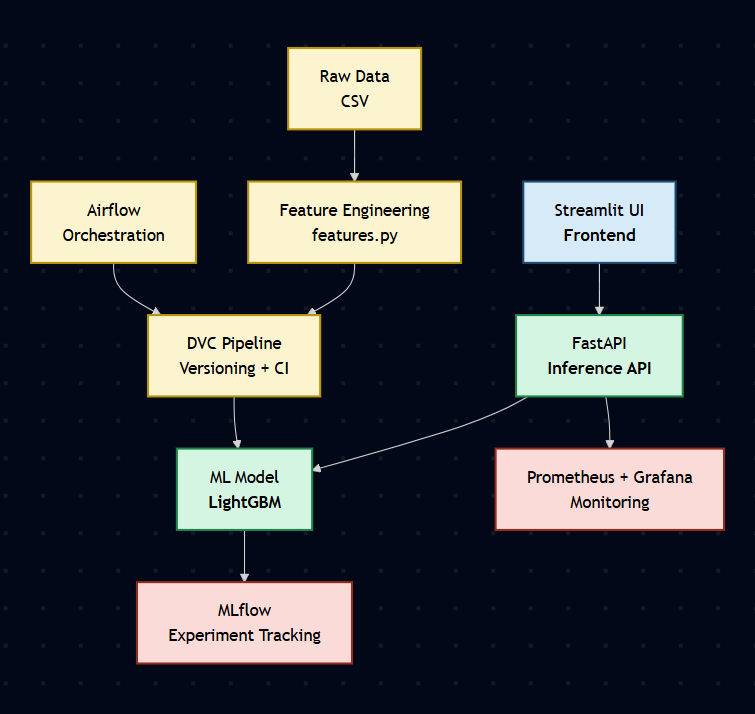
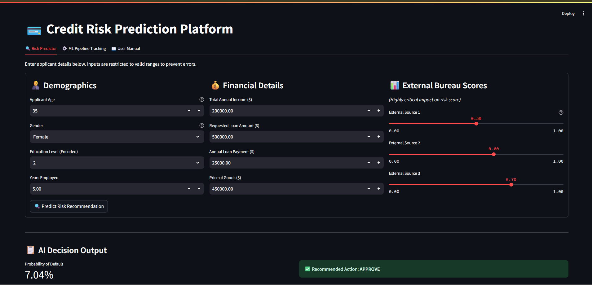

# Credit Risk Prediction Platform (MLOps Project)

An end-to-end machine learning system to predict **loan default risk** using a LightGBM model, with full MLOps pipeline integration including **DVC, MLflow, Airflow, FastAPI, Streamlit, and Prometheus**.

---

## 🚀 Overview

This project builds a production-style pipeline for predicting whether a loan applicant is likely to default. It includes:

- Data processing & feature engineering
- Model training with cross-validation
- Experiment tracking
- Pipeline orchestration
- API deployment
- UI for non-technical users
- Monitoring

---

## 🧠 Dataset

Dataset used:  
🔗 https://www.kaggle.com/competitions/home-credit-default-risk/data

**Key files:**

- `application_train.csv`
- `bureau.csv`
- `bureau_balance.csv`

**Target:**

- `1` → Default
- `0` → Non-default

---

## 🏗️ Architecture

---

## 🖥️ UI

---

## ⚙️ Tech Stack

- **Frontend:** Streamlit
- **Backend:** FastAPI
- **Model:** LightGBM
- **Pipeline:** DVC
- **Experiment Tracking:** MLflow
- **Orchestration:** Airflow
- **Monitoring:** Prometheus

---
